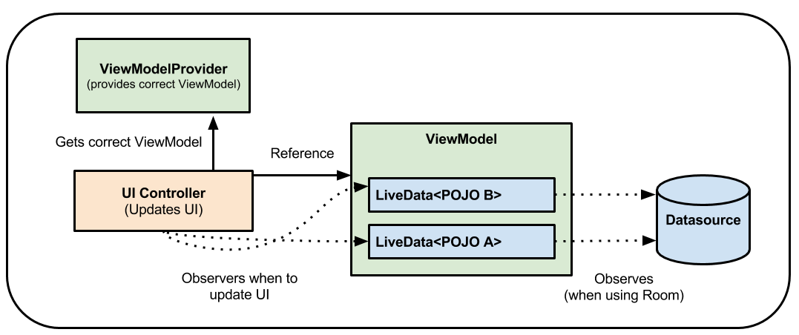

# ViewModel
[[guide][guide]]

[[`androidx.lifecycle`](https://developer.android.com/jetpack/androidx/releases/lifecycle#declaring_dependencies)]

`ViewModel` stores UI-related data in memory according to lifecycle to survive configuration changes like screen rotation.


NOTE:
1. `onCreate` may be caller serveral times due to screen rotation (means Activity destroy and re-crate)
1. `ViewModel` survives above View(Activity) and Lifecycle(with it)
1. `ViewModel` should be created the very first time `onCreate` until last finished. So a `ViewModelProvider` or `by viewModels()` delegate is needed


```java
// a ViewModel should not refer to View, Lifecycle or any that hold a reference to the activity context !!! leackage
class MyViewModel : ViewModel() {
    private val users: MutableLiveData<List<User>> by lazy {
        MutableLiveData().also {
            loadUsers()
        }
    }

    fun getUsers(): LiveData<List<User>> {
        return users
    }

    private fun loadUsers() {
        // Do an asynchronous operation to fetch users.
    }
}

// associate it with Activity
// and shared after re-create due to configuration changed
class MyActivity : AppCompatActivity() {

    override fun onCreate(savedInstanceState: Bundle?) {
        // Create a ViewModel the first time the system calls an activity's onCreate() method.
        // Re-created activities receive the same MyViewModel instance created by the first activity.

        // Use the 'by viewModels()' Kotlin property delegate
        // from the activity-ktx artifact
        val model: MyViewModel by viewModels()
        model.getUsers().observe(this, Observer<List<User>>{ users ->
            // update UI
        })
    }
}
```

## Solutions: shared ViewModel between master-detail Fragments

## Solutions: ViewModel+LiveData+Room replace Loaders

>With Loaders


>With ViewModel


Checks out the **references** each part holds


[guide]: https://developer.android.com/topic/libraries/architecture/viewmodel