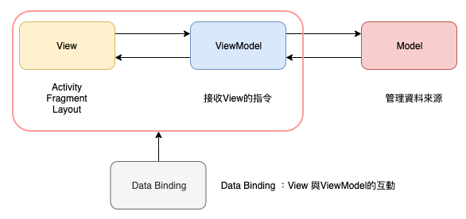

# MVVM
* `M`odel -- data model as well as data sources
* `V`iew -- UI elements handling user interaction
* `V`iew`M`odel -- sits in between
* Data binding -- between ViewModel and View

Since ViewModel's data is bound to View's UI, no need for UI reference in ViewModel. Any changes to ViewModel's data should be reflected on View's UI.


Before `MVVM`, View(`Activity` mainly) will have to get hold of UI instances(by `getViewById()`) and update its value so to update UI on screen. And listens to UI components(like `Button`) for user inputs. 

With `MVVM`, a view modal is declared and created for the View. Then data flows can be bound between the view model instance and the UI(not the view, Activity). 
> ViewModel <-> UI  

--_`build.gradle`_--
```java
android {
    ...
    dataBinding {
        enabled = true
    }
}
// Kotlin Annotation Process Tool
apply plugin: "kotlin-kapt"
```

--_`ProductViewModel.kt`_--
```java
class ProductViewModel() {
    var name: ObservableField<String> = ObservableField("")
    var name: ObservableField<String> = ObservableField("")
}
```

--_`activity_main.xml`_--
```xml
<layout>
    <data>
        <variable name="productViewModel"
            type="package.ProductViewModel"/>
    </data>

    <!-- UI changes pushed to view model-->
    <TextView ...
        android:text="@{productViewModel.name}"
    />

    <!-- button -->
    <Button ...
        android:onClick="@{() -> productViewModel.change()}"
    />
</layout>
```

--_`MainActivity.java`_--
```java
// ActivityProductBinding is auto-generated by `data-binding` from main_activity.xml

val dataBinding = DataBindingUtil.setContentView<ActivityProductBinding>(this, R.layout.main_activity)

// create repository
val productApi =
val productRepository = ProductRepository(productApi)

// here create view model instance
val productViewModel = ProductViewModel(productRepository)

// name from main_activity.<layout>.<data>.<variable>
dataBinding.productViewModel = productViewModel

// enable flow from view model -> UI
dataBinding.lifecycleOnwer = this

// init value update
```


