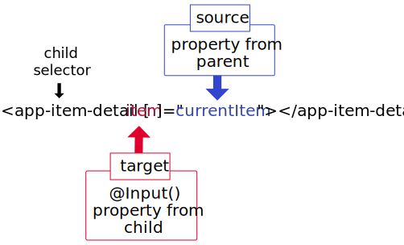

# Data (Property) Binding
* Parent -> Child `@Input()`
* Child -> Parent `@Output()`
* Two-way Binding

## Parent -> Child


--_`child.ts`_--
```typescript
import { Component, Input } from '@angular/core';
export class ChildComponent {
    // default attribute name'item'
    @Input() item: string
}
```

## Watch for Changes
`OnChanges` Angular's lifecycle hook


## Child -> Parent

--_`child.ts`_--
```typescript
import { Output, EventEmitter } from '@angular/core';

export class ChildComponent {
    @Output() itemEvent = new EventEmitter<string>();

    // whenever changes are to pushed out to parent
    itemChanged(value: string) {
        this.ItemEvent.emit(value);
    }
}
```


---
## Two-way Binding
Normal way:
```html
<!-- input element takes in value and emits input events -->
<input [value]="item" (input)="itemChanged($event.target.value)">
```
`ngModel` way:
```html
<custom-elem [(ngModel)="item"] />
```
effectivley equivalent to:
```typescript
<custom-elem [prop]="Item", (propChange)="" />

@Input() prop: string;
@Output() propChange: = new EventEmitter<string>();
```

And extra code needed for use of the name `ngModel`:
1. `ngModel` is desinged for `FormControl` or element that would be used in a `ngForm`
1. Implements `ControlValueAccessor` ([example][custom-ngcontrol])

[custom-ngcontrol]: https://blog.thoughtram.io/angular/2016/07/27/custom-form-controls-in-angular-2.html

