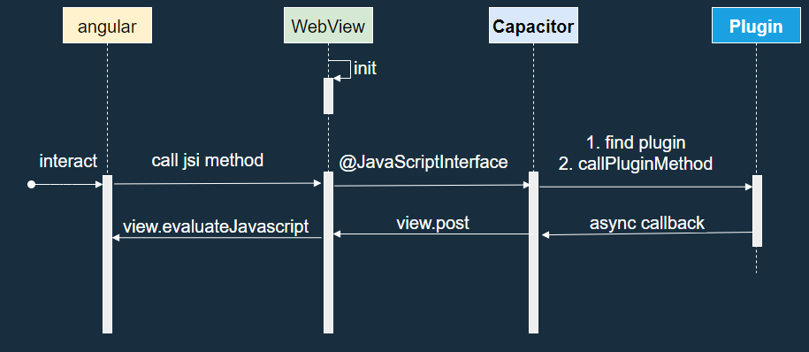
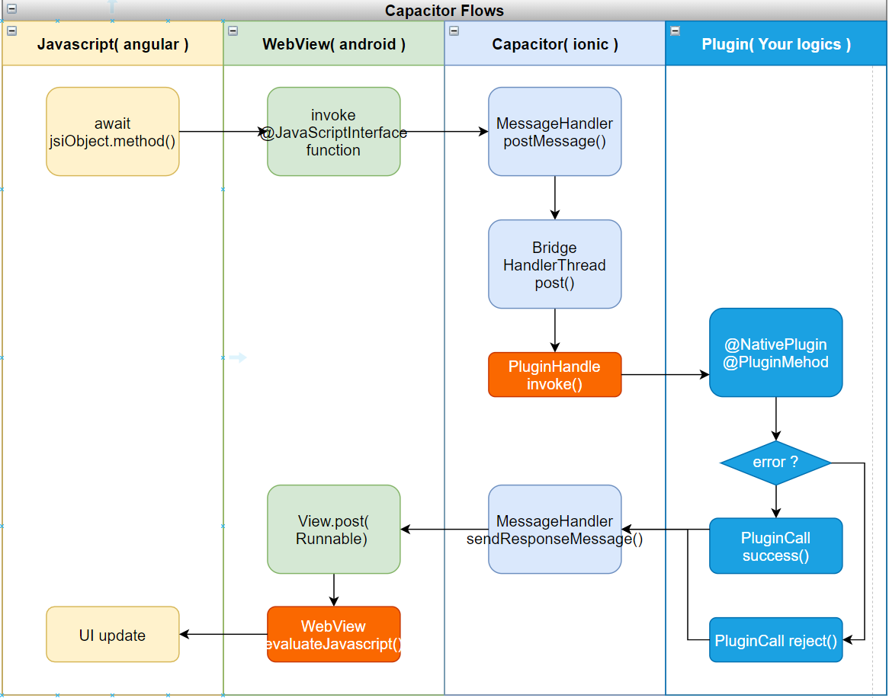

# Capacitor Plugin System

## Android

> Javascript(WebView) -> Java (android)
1. `await jsi.method()` (javascript)
1. WebView finds the registered `jsi` object and invoke its java method
1. `Capacitor.MessageHandler.postMessage()` is `@JavascriptInterface` 
1. `MessageHandler` finds its registered plugins by name and invoke its mathod wiss passed values in a `HandlerThread`
1. Custom plugin`@NativePlugin`'s `@PluginMethod` gets called and return Void.

> Java (android) -> Javascript(WebView)
1. When a plugin finished, it will asynchronously succeed with `PluginCall.success` or fail `PluginCall.reject`
1. `MessageHandler.sendResponseMessage()` forwards the async results to `WebView` by `WebView.post`ing to `WebView`'s `HandlerThread`
1. `WebView.eveluateJavascript()` gets called in `HandlerThread`(the UI thread) to update UI.

Importance:
1. All `@PluginMethod`s are invoked in a `HandlerThread` sequentially (blocking operations should take further considerations)
1. UI(`WebView`) updates will be done in the UI thread
