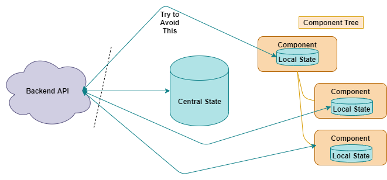
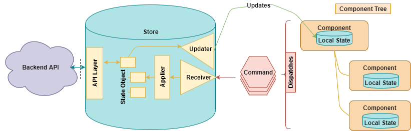

# Why State Management is Preferred
[introduction][introduction]

>Priciple applied:

    Isolate data concerns to layers

State Management implementations:
* React -- Redux
* Angular -- IOC DI service + Observable or @ngrx/store
* vue -- Vuex

>Better practice:

    Favor centralized state for business data while local(component) state for UI state.

>Benefits:
1. Only UI-related states cohesion into component, no business logics -- able to resue components
1. Centralize logics into services/app state

>Simply What should be avoided:

>Should be preferred to adopt:

Whereas the `store` could be alias to whatsoever called like `service`:
1. single state of truth (from `store`/`service`)
1. single store/service sits in-between interacting with backend APIs, and push results, recieve commands to/from components(UI)
1. single entry point of state updates into one component tree(top-down to children)

[introduction]: https://medium.com/javascript-in-plain-english/the-art-of-the-state-e19816732530