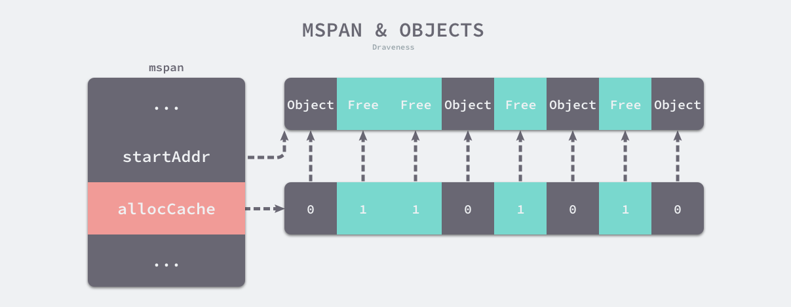
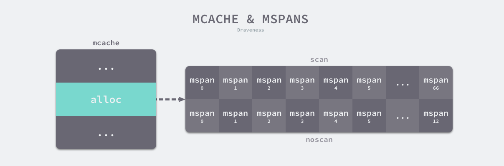

# Memory Management
it works like `TCMalloc`

---

## TCMalloc
[](https://zhuanlan.zhihu.com/p/51432385)

To put it simply:  
>1.Object(sized memory slot)

Object Class | Size
---|---
small | (0, 256 KB]
medium | (256 KB, 1 MB]
large | (1 MB, )

>2.Size Class  

8B, 16B, 32B ..., 256KB

>3.Page and Span Class  

1 Page = 8 KB  
Span Class = 1, 2, ..., 128 Pages

>4.Allocate  

For small Object(<=256KB)  
1. Round up to smallest fit size class
1. Check `ThreadCache`'s free list to find free slot (no lock)    
    a. if exits, fetch first and return
1. if not exits, try to find a bunch slots of the type from `CentralCache`'s free list  
    1. if not exits, get one `span` from `PageHeap` (256KB needs 32 Pages)  
    1. look for first free span from `PageHeap`'s free span list (n page span)  
    1. devide it into k pages for the Object and rest (n-k) pages breaks into sized free slots and insert into `CentralCache`
1. get those slots back into `ThreadCache` and return the first one

For medium size Object (256 KB, 1 MB] up to 128 Pages  
1. Round up to k pages slot
1. Look into `PageHeap`'s span list from 1 to 128 Page
1. Search from k span list and downwards for the first free slot (n pages, n>=k)
1. Insert the rest (n-k) pages into the span list and return the first k pages 

For large size Object (1 MB, -)
1. Round up to k pages slot
1. Look into `PageHeap`'s large span set
1. Search (best-fit, exhuastive iterate) and find n page slot (n >= k)
1. When rest (n-k) > 128, put it back to span set, otherwise insert into span list
1. Return first k pages

>5. Dealloc (when `free()` or `delete` object)  

1. Put it back to the head of size class in `ThreadCache` (no lock)
1. Under some circumstances, return some from `ThreadCache` back to `CentralCache` and likewise back to `PageHeap`


---
## GoLang
[golang-allocator](https://draveness.me/golang/docs/part3-runtime/ch07-memory/golang-memory-allocator/)
Object Class | Size
---|---
Tiny | (0, 16B)
Small | [16B, 32KB]
Large | (32KB, -)

### Components
* `runtime.mspan` handle tiny and small objects
* `runtime.mcache`
* `runtime.mcentral`
* `runtime.mheap` handle large object


### `runtime.mspan` Free Object/Slot list
```go
type mspan struct {
    // size of one slot it manages, see following
    spanclass spanClass 

    // span of pages from mheap into virtmem 
	startAddr uintptr // 起始地址
	npages    uintptr // 页数
	freeindex uintptr // start position to scan for free slot

    // used when allocating object/slot for app
	allocBits  *gcBits
	gcmarkBits *gcBits
    allocCache uint64
    
    // itself a doubly linked list
    next *mspan
    prev *mspan
	...
}
```
>mheap allocs pages for mspan

>mspan allocs objects for app  



`SpanClass`
> defined in `runtime.class_to_size` and `runtime.class_to_allocnpages`

> 67 span class and 134 for scan/noscan (include poiters) types

class	| bytes/obj	| bytes/span	| objects	| tail waste	| max waste
---|---|---|---|---|---
1	|8	|8192	|1024	|0	|87.50%
2	|16	|8192	|512	|0	|43.75%
3	|32	|8192	|256	|0	|46.88%
4	|48	|8192	|170	|32	|31.52%
5	|64	|8192	|128	|0	|23.44%
6	|80	|8192	|102	|32	|19.07%
…	|
66	|32768	|32768	|1	|0	|12.50%

---
### `runtime.mcache` Thread Cache
* Associated within `P`
* It has 67*2 `mspan` in an array


```go
type mcache struct {
    // array of free span list
    alloc [numSpanClass*2]*mspan

    // alloc for tiny objects
    tiny                uintptr // start addr within a mem area
    tinyoffset          uintptr // next free slot offset
    local_tinyallocs    uintptr // num of allocated
    ...
}
```


---
### `runtime.mcentral` Central Cache
* Locks required


```go
type mcentral struct {
	lock      mutex
	spanclass spanClass
	nonempty  mSpanList
	empty     mSpanList
	nmalloc uint64
}
```
When allocating to `mcache` for spanClass sized objects, it searchs in the `nonempty` and `empty` span list for free `mspan`.


---
### `runtime.mheap` Heap Area
* Singleton in a GoLang app


### Virtual Memory Layout

>Sparse Heap


```go
// one heapArena manages 64 MB
// runtime.heapArena
type heapArena struct {
	bitmap [heapArenaBitmapBytes]byte
	spans [pagesPerArena]*mspan
	pageInUse [pagesPerArena / 8]uint8
	pageMarks [pagesPerArena / 8]uint8
    // start address of virtmem slot
    zeroedBase uintptr 
}
```
On linux/amd64, `runtime.mheap` maintains 4,194,304 `runtime.heapArena`(64MB) which means it controlls 256 TB virtual memory


### Allocate
* `runtime.newobject` -> `runtime.mallocgc(size, type, zero) pointer`
* depends on size of object, it will
    * tiny(<16B) tiny allocator, then mcache, mcentral and mheap
    * small(<=32KB) go mcache, mcentral and mheap
    * large(>32KB) go directly mheap

