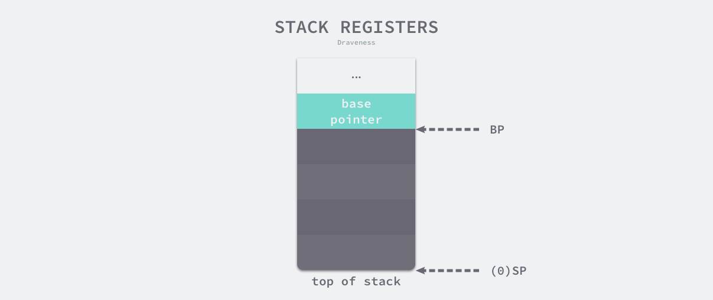
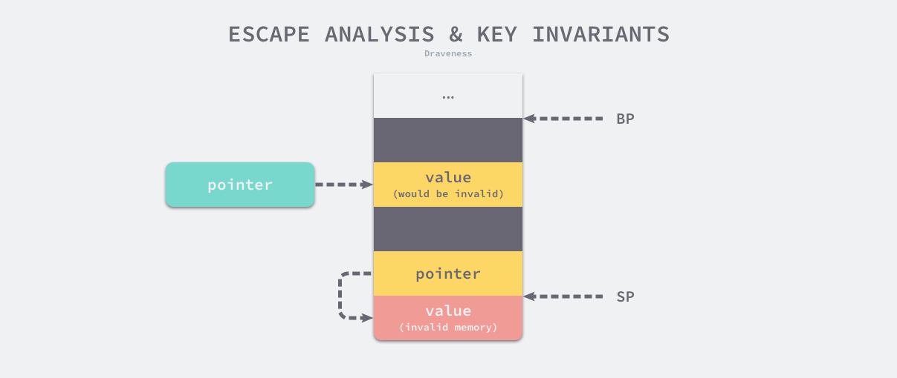

# Stack

>What is it  
Controlled by compiler, (alloc and free), the stack holds passed-in parameters and results to be returned to caller

Registers it needs | Name | Purpos
---|---|---
`SP` | Stack Pointer | Address of top of stack
`BP` |  Base Pointer | Address to start of current stack frame





>What lays between `SP` and `BP`  
The current function/subroutine's call stack, including passed-in paraters, value to return and local variables 

## Thread Stack

When creating a thread (like `pthread_create` on Linux), by default (unless specified) it allocats a stack with size:
ARCH | SIZE
---|---
i386 | 2 MB
x86_64 | 2 MB

While a `goro`'s stack space only requires `2KB`.


## Variable Escape
A language of manual memory(stack and heap) management(alloc and free) goes in troubles like: 
>Alloc to-be-on-stack var onto heap  
    
    waste memory (should be short-lived)
>Alloc to-be-on-heap var onto stack 

    danging potiners (address where should not access). E.g, returning pointers to a local var

>Go statically makes sure (by AST) 
* pointers to stack can not be saved onto heap
* pointers to stack can not outlive the stack



## Goro Call Stack
After `v1.4` GoLang's goro gets initial stack of 2KB and managed as **`CONTINUOUS STACKS`** which implies:
1. allocs more memory when expansion needed
1. copy values from old to new
1. refresh all pointers to old into new
1. free old

>Where is allocated stack  
All goro's stack is allocated from `mspan`, so it is essentially on heap. Becuase the size goes from initial 2KB to expanded 32 KB and more, it is more likely from `mcache` and `mheap` for larger stack. (`mcache` for <= 32KB, `mheap` for > 32KB)

```go
type stack struct {
	lo uintptr
	hi uintptr
}
```

## Stack Layout
1. thread stack pool from `mcache`
```go
type mcache struct {
	stackcache [_NumStackOrders]stackfreelist
}
```
2. global stack pool `runtime.stackpool`
1. `runtime.stackLarge` from `mheap` 