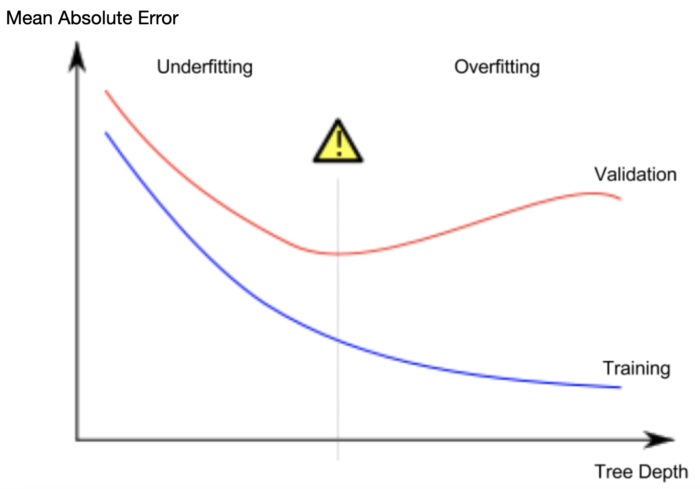

# Decision Tree

## What

>Single Decision Tree  
`sklearn.tree.DecisionTreeRegressor`  
Classifier from input variables to outputs as categories.  
* Import parameters: Tree Depth  

* Impacts: underfitting and overfitting
    * overfitting - deep tree with lots of leaves and few data at leaf nodes
    * underfitting - shallow tree with lots data at leaf nodes


>Random Forests  
`sklearn.ensemble.RandomForestRegressor`  
Many decision trees with default parameters
* Important parameters
    * n_estimators: num trees
    * max_depth: max tree size
    * min_samples_split: ???
    * criterion: error method

>`xgboost`  

---

## How-to in general
`sklearn.tree.DecisionTreeRegressor`  
1. Define - pick a proper model
1. Fit
1. Predict
1. Evaluate
    * MAE (Mean Absolute Error) mean(abs(y-pred_y))
    `sklearn.metrics.mean_absulote_error`
    * std (Standard Deviation) sqrt(mean(x))

## Train and deploy in practice
Determine the most important parameter: _`Tree Depth`_
1. with picked model
1. split data set into train and validation sets
1. loop with _`Tree Depth`_ candidates
    1. train with train data and testing _`Tree Depth`_
    1. validate result with _`MAE`_
    1. find the _`Tree Depth`_ with least _`MAE`_ (where the yellow exclamation mark in the following image)
1. train with whole data set with the found _`Tree Depth`_
1. predict



```python
from sklearn.tree import DecisionTreeRegressor

# to ensure same results each run
model = DecisionTreeRegressor(random_state=1)

# fit
y = home_data.Price
X = home_data[['Rooms', 'Bathroom', 'Landsize', 'Lattitude', 'Longtitude']]
model.fit(X, y)

# predict
model.predict(X.head())
```

## Split Data Set
Split data set into two groups:
1. training
1. validation

With `sklearn.model_selection.train_test_split`  
```python
from sklearn.model_seelction import train_test_split

train_X, val_X, train_y, val_y = train_test_split(X, y, random_state = 0)

model = DecisionRegressor()

# fit with training data
model.fit(train_X, train_y)

# predict with validation data
val_pred = model.predict(val_X)

# validating with MAE
mean_absolute_error(val_y, val_pred)

```

```python
import pandas as pd
# Error validation method
from sklearn.metrics import mean_absolute_error
# split data set
from sklearn.model_selection import train_test_split
# decision tree
from sklearn.tree import DecisionTreeRegressor

# read data set
# cleanse(dropna, fillna)
# y
y = dataset.y_column
# X
features = picked_columns
X = dataset[features]

# split data set
train_X, val_X, train_y, val_y = train_test_split(X, y, random_state=1)

# loop to find the best fit Tree Depth(max_leaf_nodes)
candidate_max_leaf_nodes = [5, 25, 50, 100, 250, 500]
# find the Tree Depth(max_leaf_nodes) with the lest mae
mae_scores = { leaf_size: get_mae(leaf_size, train_X, val_X, train_y, val_y) for leaf_size in candidate_max_leaf_nodes }
best_tree_size = min(mae_scores, key=mae_socres.get)


# deploy the model with best found parameter Tree Depth
model = DecisionTreeRegressor(max_leaf_nodes=best_tree_size, random_state=1)
# fit model with whole data set
model.fit(X, y)
# predict ...

def test_mae(max_leaf_nodes, train_X, val_X, train_y, val_y):
    model = DecisionTreeRegressor(max_leaf_nodes=max_leaf_nodes, random_state=0)
    model.fit(train_X, train_y)
    pred_val = model.predict(val_X)
    mae = mean_absolute_error(val_y, pred_val)
    return mae
```
