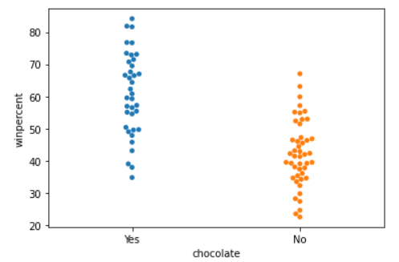

# Charts

CATEGORY | CHART TYPE | USAGE
---|---|--- 
distribution | `displot`   `kdeplot` (2D KDE)   `jointplot` | 
relation | `barplot`   `heatmap`   `scatterplot`   `swarmplot`   `regplot`   `lmplot` |
trends | `lineplot` |

* distribution
    * jointplot
    * kdeplot
    * displot
* relation
    * barplot
    * heatmap
    * scatterplot
    * swarmplot
    * regplot
    * lmplot
* trends
    * lineplot

## Scatter

Depict data set in partterns:
* For chocolate candies, the line has a _slightly_ `positive slope`, implies that _more expensive_ chocolate tend to be _more popular_.
* Likewise, the regression line for those without chocolate has a `negative slope`, we can say that candies without chococlate tend to be _more popular_ when they are _cheaper_

## Swarm

Depict:
Chocolate candies tend to be _more popular_ than those without chocolate.

## Bar, Histogram and KDE
* A bar chart is a `categorical` label against its `numeric`
* A histogram is a `numeric range` sliced as bins against its _`occurencies`_ 
* a KDE (Kernel Density Estimate) is a transformed `normal distribution`

