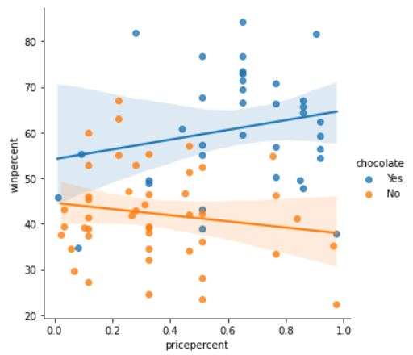

# seaborn
* lineplot
* barplot
* heatmap
* scatter
 

<style>
    img[alt=scatter_img] {
        width: 50%
    }
</style>


> 2-variable correlation (2-dimensional chart)

CHART TYPE | first axis | second axis | categorical or continuous
---|---|---|---
line | index | value | BOTH
bar | x | y | categorical
scatter | x | y | numerical


## setup
```python
import pandas as pd
# what for ???
pd.plotting.register_matplotlib_converters()

import matplotlib.pyplot as plt
%matplotlib inline
import seaborn as sns
```

## setup figure
> viewport size  
`plt.figure(figsize=(16, 6))`  

> figure title  
`plt.title("title")`

> x-axis label  
`plt.xlabel("Date")`

## color palette
`palette = sns.color_palette('husl', n_colors=num_colors)`

## line chart
Series (single line)  
`sns.lineplot(data['column_name'], label='label_name')`  

DataFrame (collection of Series)
`sns.lineplot(data)`

## bar chart (categorical chart)
`sns.barplot(x=x_list, y=y_list)`

## histogram
`sns.histplot(data=series)`
`sns.displot(data=series, label=rename_series, kind='hist')`  

## kde histogram (distribution histogram)
`sns.kdeplot(data=series, shade=True)`
`sns.displot(data=series, label=name, kind='kde')`
> 2D KDE plot  
`sns.jointplot(x=series, y=series, kind='kde')`  

## scatter chart (numerical barchart)
`sns.scatterplot(x=data_list)`  
`sns.scatterplot(y=data_list)` 

> extra regression line  
`sns.regplot(x=x_list, y=y_list)`  
equals to `sns.lmplot(x=x_col, y=y_col, data=source)`    
`sns.lmplot(x=x_col, y=y_col, hue=categorical_col, data=df)`

> multi scatter plots with colors  
`sns.scatterplog(x=x_list, y=y_list, hue=categorical_values)`

## swarm chart (categorical scatter chart)
`sns.swarmplot(x=x_list, y=y_list)` 

## heatmap
`sns.heatmap(data=data, annot=True)`
_annot_ keeps value numbers for each cell