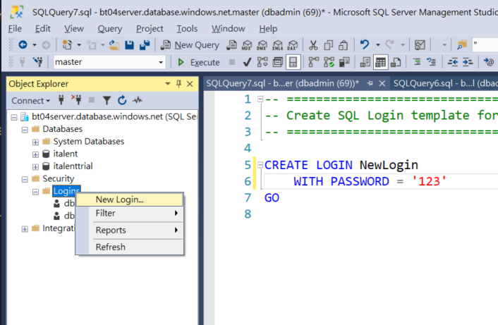
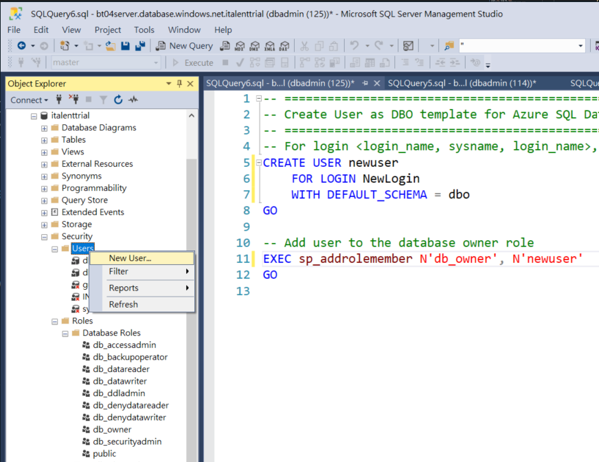

# User Management
* Create a user
* Associate a user with roles(permission groups)
* Grant permissions

---

## Create User
[Tutorial: howto-create-user][create-user]

1. Create `Login`
2. Create `user` using the `Login`
3. Associate the `user` with predefined/custom `roles`

### Create `Login`
`CRAETE LOGIN NewLogin WITH PASSWORD='123'`  

Or 
[SSMS]  
-> [Connection Object]  
-> [Security]  
-> [Logins]  
-> [New Login]



### Create `user` for a Database with the Login
```sql
-- For login <login_name>, create a user in the database
CREATE USER newuser
	FOR LOGIN NewLogin
	WITH DEFAULT_SCHEMA = dbo
GO

-- Add user to the database owner role
EXEC sp_addrolemember N'db_owner', N'newuser'
GO
```

Or [SSMS]  
-> [Connection Object]  
-> [Database object]  
-> [Security]  
-> [Users]  
-> [New User]


---

## Associate user with Roles

### 1. List users with associated roles 
```sql
SELECT p.NAME role_name, m.NAME [user]

FROM sys.database_role_members rm

JOIN sys.database_principals p

ON rm.role_principal_id = p.principal_id

JOIN sys.database_principals m

ON rm.member_principal_id = m.principal_id
```
>Output  

role_name |	user  
---|---
db_owner | dbo
db_datareader | dbuser
db_datawriter | dbuser

>Roles   
[SSMS]  
-> [Connection Object]  
-> [Database Object]  
-> [Security]  
-> [Roles]
* `db_owner`: will not be affected by `dynamic mask`
* `db_datareader`: will be affected by `dynamic mask`
* `db_datawriter`: will be affected by `dynamic mask`

### 2. Associate a user with a role
`EXEC sp_addrolemember N'role', N'newuser'`

### 3. Dissociate
[official][drop-rolememeber]  
`EXEC sp_droprolemember N'role', N'user'`


[create-user]: https://www.guru99.com/sql-server-create-user.html
[drop-rolememeber]: https://docs.microsoft.com/en-us/sql/relational-databases/system-stored-procedures/sp-droprolemember-transact-sql?view=sql-server-ver15#:~:text=To%20remove%20a%20user%20from,a%20member%20to%20a%20role.

