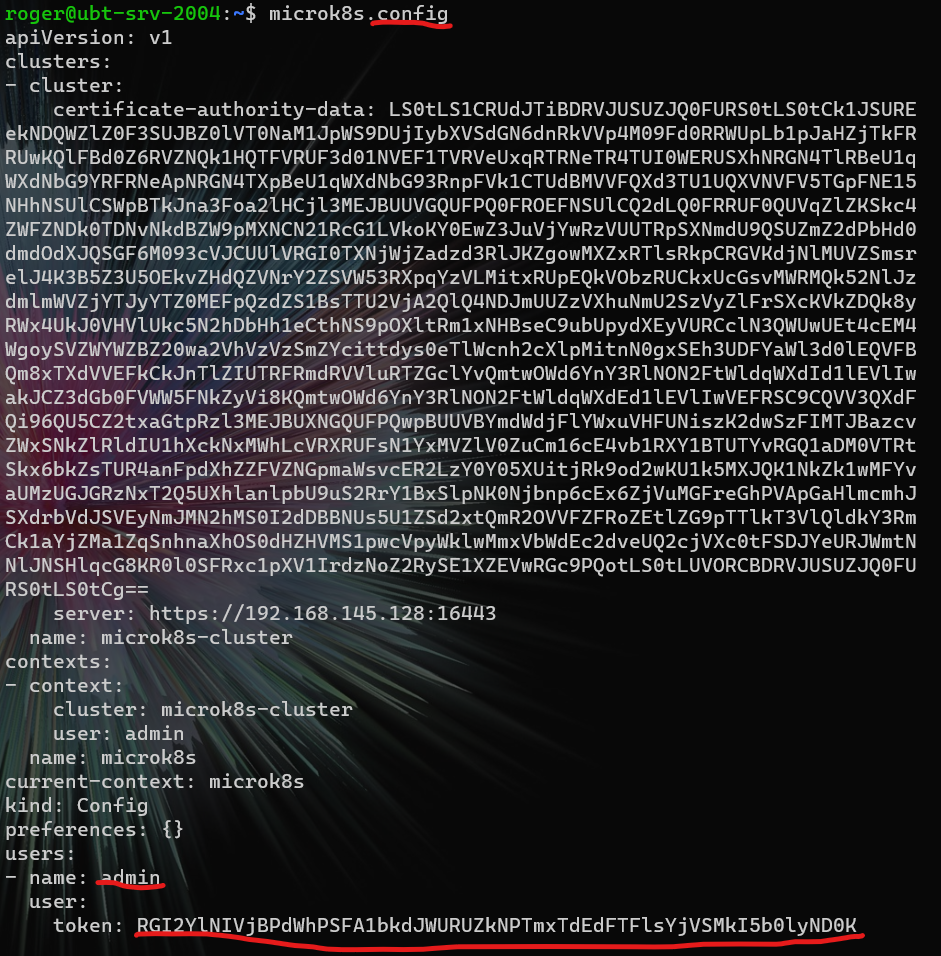

# install microk8s
1. on linux/VM

## Installation
> 1. install Ubuntu server with Microk8s service preinstalled
`$ sudo snap install microk8s --classic [--channel=1.21.1/stable]`  
`$ microk8s enable dns dashboard storage`  
`$ microk8s status`  
`$ microk8s config`  
`$ kubectl get all --all-namespaces`  

> 2. setup **snap alias**  
`$ sudo snap alias microk8s.kubectl kubectl`

## Management
1. status
1. config
1. inspect
1. start
1. stop

## The k8s dashboard
[[enable dashboard][mk8s-dashboard]]
1. find/config user/token crendential
    1. `$ microk8s.config` find **users[0].name/user.token**
    2. `$ microk8s kubectl -n kube-system get secret | grep default-token | cut -d " " -f1` found **default-token-qvbfr**
    1. `$ microk8s kubectl -n kube-system describe secret default-token-qvbfr` find **token**
    1. from **config** found **server IP address=ServerIP:16443** 
    1. `$ curl -k -H 'authorization: bearer $token' https://vmip:16443` list of API endpoints
1. find k8s dashboard service IP
1. forward routing  
    `$ microk8s kubectl port-forward -n kube-system service/kubernetes-dashboard 10443:443 --address 0.0.0.0`  
    This command will forward connections from `0.0.0.0:10443` on host machine to 443 port of kubernetes-dashboard vm.

## Deployment
> 1. create deployment and scale  
`$ microk8s kubectl create deployment microbot --image=dontrebootme/microbot:v1`  
`$ microk8s kubectl scale deployment microbot --replicas=2`
> 2. expose as service  
`$ microk8s kubectl expose deployment microbot --type=NodePort --port=80 --name=microbot-service`

> 3. check exposed service  
`$ microk8s kubectl get all --all-namespaces`  

NAMESPACE | NAME | TYPE | CLUSTER-IP | EXTERNAL-IP | PORT(S) | AGE
--|--|--|--|--|--|--|
default | service/microbot-service | NodePort | 10.152.183.248 | < none > | 80:30485/TCP | 7m43s

The `defalut` `service/microbot-service` is accessible from port `30485` host machine.

## Microk8s Commands

Command | Purpose
--|--
microk8s `status`| Provides an overview of the MicroK8s state (running / not running) as well as the set of enabled addons
microk8s `enable`| Enables an addon
microk8s `disable`| Disables an addon
microk8s `kubectl`| Interact with kubernetes
microk8s `config`| Shows the kubernetes config file
microk8s `istioctl`| Interact with the istio services; needs the istio addon to be enabled
microk8s `inspect`| Performs a quick inspection of the MicroK8s intallation
microk8s `reset`| Resets the infrastructure to a clean state
microk8s `stop`| Stops all kubernetes services
microk8s `start`| Starts MicroK8s after it is being stopped

## `Kubectl` Commands
1. get nodes
1. get deployment
1. get services
1. get pods
1. create deployment name --image=xxx
1. scale deployment name --replicas=numRep
1. expose deployment name --type=NodePort --port=PORT --name=SERVICE-NAME

[mk8s-dashboard]: https://microk8s.io/docs/addon-dashboard
