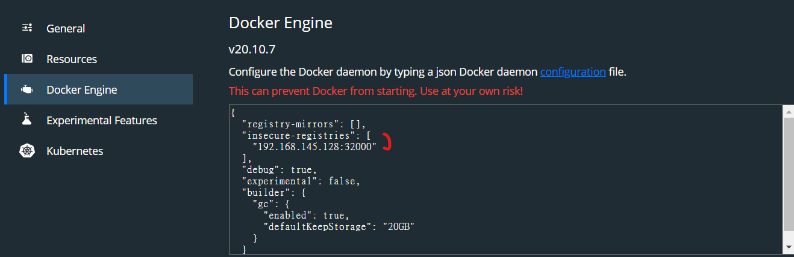

# microk8s private registry
1. enable
1. build image
1. config docker insecure registry
1. publish
1. pull

Image tags:
1. microk8s cluster running locally: `localhost:32000/name:tag`
1. microk8s cluster running in VM: `VM-IP:32000/name:tag`

> Enable registry  
`microk8s enable registry:size=20Gi`

> Build image with tag    
`$ docker build . -t localhost:32000/image-name:tag`

> Config docker   
-- _`/etc/docker/daemon.json`_ --
```json
{
    "insecure-registries": [
        "localhost:32000"
    ]
}
```
`$ sudo systemctl restart docker`

_`docker desktop`_  



If microk8s runs in VM, config register as `VM-IP:32000`

> Publish Image  
`$ docker tag image localhost:32000/image:tag`

> Pull  
`$ microk8s kubectl create deployment microbot --image=dontrebootme/microbot:v1`  
`$ microk8s kubectl scale deployment microbot --replicas=2`  
`$ microk8s kubectl expose deployment microbot --type=NodePort --port=80 --name=microbot-service`  

[microk8s-registry]: https://microk8s.io/docs/registry-built-in
