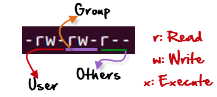

# File Permissions And Ownership

Format of file permissions are like:  


`irwxrwxrwx`

## Change Permission
`chmod <perm> file`

### With **Numeric**/Absolute Mode

Number | Permission Type | Symbol
---|---|---
0 | No Permission | ---
1 | Execute | --x
2 | Write | -w-
3 | Execute + Write | -wx
4 | Read | r--
5 | Read + Execute | r-x
6 | Read +Write | rw-
7 | Read + Write +Execute | rwx 

>Illustrate  
>**-rw-rw-r--** 0664  
>`$ chmod 764 file`  
>**-rwxrw-r--** 0764  


### With **symbolic** Mode
`$ chmod <user><operator><r|x|w> file`

Operator | Descripion
---|---
+ | Adds a permission to a file or directory
- | Removes the permission
= | Sets the permission and overrides the permissions set earlier.

User | Denotations
---|--
u | user/owner
g | group
o | other
a | all

>Illustrate:  
>**-rw-rw-r--** 0664  
>`$ chmod o=rwx file`  
>**-rw-rw-rwx** 0667  
>`$ chmod g+x file`  
>**-rw-rwxrwx** 0677  
>`$ chmod u-r file`   
>**--w-rwxrwx** 0477

## Change Ownership
`chown UID file directory`  
`chgrp GID file directory`  
`chown UID:GID file directory`

* -R recursively

```bash
# fix ownership for contents of a service account
$ chown -R showroom:showroom /home/showroom
```
