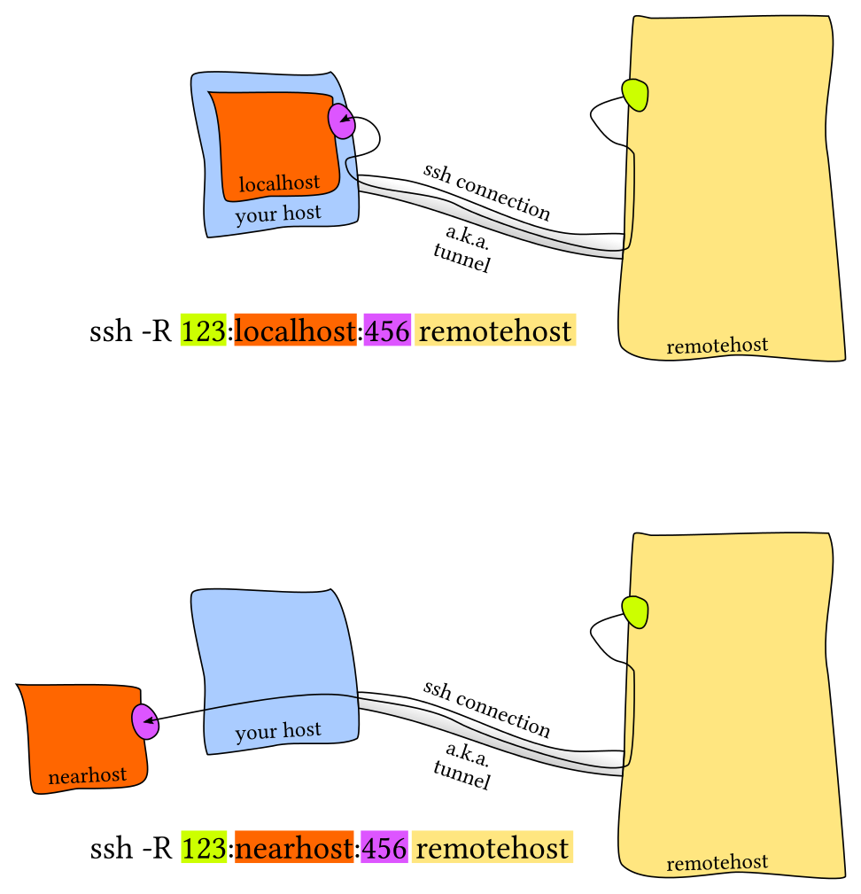

# `ssh`
1. Execute COMMANDs over `ssh` to remote server
1. Transfer files over `ssh` by `scp`
1. Port forward to REMOTE
1. Reverse forward to LOCAL

---

## Execute Remote COMMAND

`ssh <user>@<host> [-t] [-p 22] [-i KEY_FILE] [CMMD]`
* -t: force tty, used to capture STDIN for remote host
* -p: use port other than 22
* -i: specify key file


```bash
# remote u1 sudo password is needed
# STDIN will be captured and sent over
ssh u1@host1 -t sudo ls /root
>>> u1@host1 password:
>>> [sudo] password for u1:

```

---

## Transfer Over SSH

Senario | Means
---|---
single file | `scp`
single big file | `scp -C`
large num of files | `tar cvfz - <dir> | ssh u@h 'cd /home/u/t && tar xcfz -'` <br> `tar cvfz - <dir> | shh u@h 'tar xcfz - -C <cd-dir>' `

`scp -rp -B host:FILE1 ... host:FILE2`  
* -r: recursively
* -p: perserve atime, ctime and permission, but as the remote user 

## Port Forward
[explain][ssh-forward]
* -f|-n : -n NOT stdin(key file only), -f force background(implies -n)
* -N : NO remote COMMAND, only forward port
* -T : NO tty
* -t : force tty(capture STDIN from remote)


## LOCAL port forward to REMOTE


`$ ssh -L localPort:remoteHost:remotePort sshUser@sshServer`


## REMOTE reverse forward to LOCAL


`$ ssh -R remotePort:localHost:localPort sshUser@sshServer`


[ssh-forward]: https://unix.stackexchange.com/questions/46235/how-does-reverse-ssh-tunneling-work

