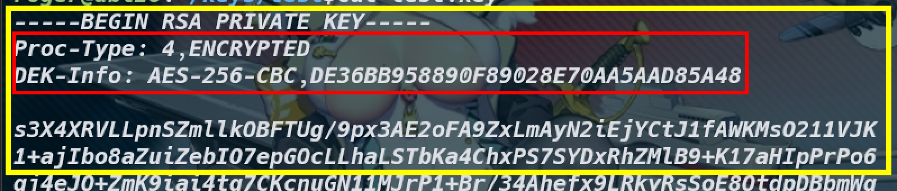

# Create x509 Certificate
1. create key pairs (ssh/openssl)
1. create csr
1. sign csr (self-sign cert)
1. bundle chain
---

## 1. Create Key Pair
Two forms:
* ssh
* openssl

### openssl
> create PRIVATE key

`openssl genrsa -out KEY.PEM 2048`  
* -aes256: need encrypt
* -passout *SOURCE*
    * stdin
    * pass:*PASSPHRASE*
    * file:*FILEPATH*
> extract PUBLIC key

`openssl rsa -in KEY.PEM -pubout -out PUB.PEM`  
* -passin *SOURCE*
    * pass:*PASSPHRASE*
    * file:*FILEPATH*



---
## 2. Create CSR
`openssl req -new -newkey rsa:2048 -keyout CSR.KEY -passout STDIN -out CSR.CSR -config CONFIGFILE`  
* -new: create CSR
* -newkey rsa:2048 along create a new key
* -keyout: write new key
* -passout *SOURCE*: passpharse source
* -out *CSRFILE*: write csr file
* -config *CONFIGFILE*: config file
--- 
## 3. Sign CSR into CERT
`openssl x509 -req -days 365 -CA CACERT -CAkey CAKEY -passin pass:cakeypharse -CAcreateserial -in SITECSR -out SITECERT -extensions V3_req -extfile CONFIGFILE`
* x509 -req -days 365: sign csr
* -CA CACERT -CAkey CAKEY -passin pass:CAPASS: use this CA to sign
* -in: CSR to be signed
* -out: write signed CERT
* -extensions V3_req: use V3_req extenstion
* -extfile *CONFIGFILE*: config file

> Self-signed CERT

For testing purpose, need to generated a self-signed cert and then deploy it directly or use it as the CA:  
`openssl req -x509 -days365 -newkey rsa:2048 -keyout CA.KEY -passout pass:CAPASS -out CACERT -subj SUBJECT`
* req -x509 -days365: to sign a CSR
* -newkey rsa:2048 -keyout CA.KEY -passout pass:PASS: along to create a new key
* -out CACERT: write cert file
* -subj SUBJECT: use this subject in the cert 
* SUBJECT: `/C=TW/O=digiwin/OU=newsales/CN=CUSTOM CA`
---

## 4. Bundle Chain
Bundl the site cert, all intermedia certs and the ca cert in order.   

`cat SITECERT INTERCERT CACERT > bundle.cert`  
or  
`gc SITECERT, INTERCERT, CACERT | set-content bundle.cert`

## 5. Verify Site Cert against Chain Cert
`openssl verify -show_certs -CAfile bundle.cert SITECERT`

---

## the *config file*
```ini
[req]
distinguished_name = req_distinguished_name
req_extensions = v3_req
prompt = no

[req_distinguished_name]
countryName = TW
stateOrProvinceName = TC
localityName = Taichung
organizationName = digiwin
organizationalUnitName  = newsales
commonName = ip.newsales.digiwin.com

[ v3_req ]
# Extensions to add to a certificate request
basicConstraints = CA:FALSE
keyUsage = nonRepudiation, digitalSignature, keyEncipherment
subjectAltName = @alt_names

[alt_names]
IP.1 = 192.168.1.1
```